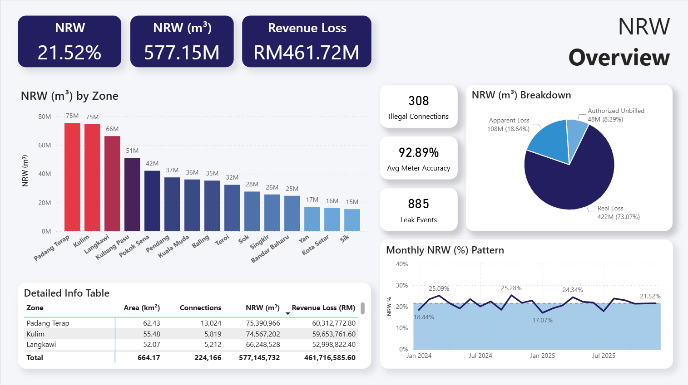

# Power BI NRW Reduction Dashboard

This Power BI dashboard visualises non-revenue water (NRW) metrics and monitors reduction efforts over time for municipal water utilities. Key insights include water losses by zone, leak trends, water supply efficiency, and cost-impact metrics.

---

## Overview  

This report allows users to explore NRW reduction efforts through interactive visuals and dynamic filters. Features include:  

- Water loss volume and percentage by zone  
- Leak detection and resolution trends  
- Water supply vs billed water comparison  
- Cost impacts of NRW (e.g., revenue loss, repair costs)  
- Time filters (year, quarter), geographic zone filters, and tier filters  

---

## Report Features  
### 1. Loss by Zone  
A bar or donut chart comparing NRW percentage across service zones, helping to identify high-loss areas.  

### 2. Leak Trend Over Time  
A line or area chart tracking the number of detected leaks and volume of water lost over time, enabling seasonality and trend analysis.  

### 3. Supply vs Billed Water  
A paired column (or combo) chart showing supply water volume against billed water volume, revealing inefficiencies in the supply chain.  

### 4. Cost Impact Analysis  
A visual (tree map or KPI cards) illustrating cost of losses: estimated revenue loss + repair/maintenance cost by zone and for the utility overall.  

### 5. Reduction Progress Dashboard  
A summary view with KPIs tracking NRW reduction target, current performance, year-on-year change, and zones showing greatest improvement or decline.  

---

## Insights  
- Some zones account for the majority of NRW losses, indicating targeted intervention potential.  
- Leak incidents cluster seasonally (e.g., during dry season), suggesting proactive maintenance windows.  
- The supply-to-billed ratio is below industry benchmarks, signalling opportunity for process improvement and infrastructure upgrades.  
- Cost of NRW remains significant in revenue terms; small percentage improvements yield large financial benefits.  

---

## Tools & Techniques  
- **Power BI Desktop** – for report building, modelling and visuals creation  
- **DAX** – used for calculating NRW metrics such as volume loss, percentage loss, cost impact  
- **Power Query / M** – used to clean and transform raw water-supply, billing and leak-detection datasets  
- **CSV / Excel** – source files for dataset import and preparation  

---

## Dashboard Preview  

---

## Data Notice  
All data used in this project is either anonymised or generated for demonstration/portfolio purposes. This dashboard is intended for educational and portfolio display use only.  

---

### License  
MIT License  

